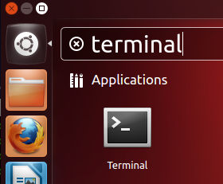

# 1. Install Ubuntu
* Make sure you have properly configured a profile in your [Amahi control panel](https://www.amahi.org/users)
* Download the Ubuntu 12.04 CD from the [ubuntu downloads](http://www.ubuntu.com/download) page
* Boot the installation machine from the Ubuntu installation CD. See the [requirements](requirements.html)
* Install Ubuntu until you **get to the desktop** (or the command line in the server).  See <a href="http://netgator.blogspot.com/2012/04/ubuntu-1204-installation-process-slide.html" target="_">this article</a> for detailed instructions on installing Ubuntu.

# 2. Install Amahi

* At the desktop, start a terminal window. On the Dash home, search for _terminal_. Click on the icon with caption _terminal_

* Execute this command in the terminal window:

	`wget http://u12.amahi.org/install-amahi`
* Then start the Amahi install process with

	`sh install-amahi`

* The install script will ask for two things
	1. Your **password**. Some of it runs as an administrator user
	1. Your **install code**. You get this from your [Amahi control panel](https://www.amahi.org/users)

* This should take a while: about 5~10 minutes on a recent system
* The time it takes depends on the speed of your PC and your internet connection
* Once the installation is completed the system will ask you to reboot

* Rebooting will change the IP address of your system to the address you gave in your [Amahi control panel](https://www.amahi.org/users)

# 3. Using Amahi

After rebooting, `http://hda` should be working if entered on the local system. From a remote system this will only work if you have your DNS pointing to the Amahi system as otherwise your system cannot resolve the name "hda".

If your HDA appears to work well, you may turn off DHCP on your router and **reboot all clients** in your network, so that they get their IP from your HDA!

Start setting up your users, your shares, install some apps and enjoy!!
