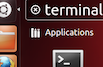
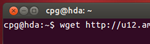
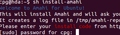
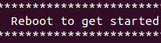
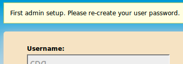

# 1. Install Ubuntu
* Make sure you have properly configured a profile in your [Amahi control panel](https://www.amahi.org/users)
* Download the Ubuntu 12.04 CD from the [ubuntu downloads](http://www.ubuntu.com/download) page
* Boot the installation machine from the Ubuntu installation CD. See the [requirements](requirements.html)
* Install Ubuntu until you **get to the desktop** (or the command line in the server).  See <a href="http://netgator.blogspot.com/2012/04/ubuntu-1204-installation-process-slide.html" target="_">this article</a> for illustrated instructions on installing Ubuntu.

# 2. Install Amahi

* At the desktop, start a terminal window. On the Dash home, search for _terminal_. Click on the icon with caption _terminal_

	

* Execute the following two commands in the terminal window:

	`wget http://u12.amahi.org/install-amahi`

	`sh install-amahi`

	

* The first command gets the installer and the second one starts the Amahi install. The install script will ask for two things
	1. Your **password**. Some of it runs as an administrator user
	1. Your **install code**. You get this from your [Amahi control panel](https://www.amahi.org/users)

	

* This part may take about 5 to 10 minutes on a recent system, much more on older ones

* The time it takes depends on the speed of your PC and your internet connection 

* Once the installation is completed the installer **will ask you to reboot**

	

## Installation Notes

* Rebooting will change the IP address of your system to the address you gave in your [Amahi control panel](https://www.amahi.org/users) 

* Only the first ethernet card `eth0` is supported out of the box. See [other options](http://wiki.amahi.org/index.php/ETH1) 

# 3. Using Amahi

* After rebooting, your Amahi HDA (Home Digital Assistant), should be fully working. Now it's time to set it up. When the system gets to the desktop, there are two links with Amahi logos on them. Click on the Dashboard one. Firefow should come up.

	

* Firefox should come up with `http://hda` and ask you to login. You should use the credentials of the user you created when installing Ubuntu. The username and the password are *case sensitive*. The first login is special, since the first user will be set up at this point, by asking the reset the password.

	

* At this point the system should be set up and fully operational.

* To access your HDA from a remote system, things will only work if you have your DNS pointing to the Amahi system as otherwise your system cannot resolve the name "hda".

* If your HDA appears to work well, you may optionally turn off DHCP on your router and **reboot all clients** in your network, so that they get their IP from your HDA!

Start setting up your users, your shares, install some apps and enjoy!!

**NOTE:**  SSH ([OpenSSH](http://www.amahi.org/apps/openssh) or [Dropbear](http://www.amahi.org/apps/dropbear)) and VPN ([OpenVPN](http://www.amahi.org/apps/openvpn)) are not installed by default.  You will need to install them via your HDA dashboard.
